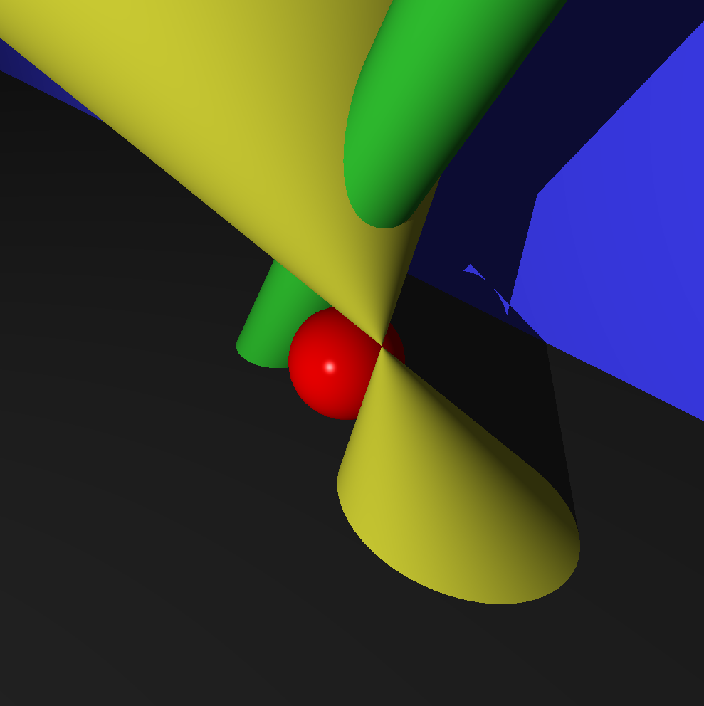

# ft_rtv1

RTv1 is a simple ray tracing program. It parses a 3D scene from a file and applies ray tracing algorithm to render the given scene.
Note: this project was made for MacOS.
if you don't have MacOs you can check this link https://github.com/ilkou/minilibx it explains how to work with minilibx in windows / linux

# Installation

Clone or download this repository and run : ```make```

# Usage

```./RTv1 [filename]```
```filename``` must contain path to a valid scene.
If the scene is not valid, RTv1 will write corresponding error on standard output.

# Scene Syntax

Scene is a file which describes camera, lights and geometric objects that have to be rendered. This project can render such geometric shapes:

* Sphere;
* Infinite Plane;
* Infinite Cylinder;
* Infinite Cone.

if you want to test your own scene check the ```file_indicator``` in repository 'files' to have an idea how to write a valid scene.

# Screenshots

* Demo 1:


* Demo 2:


* Demo 3:


